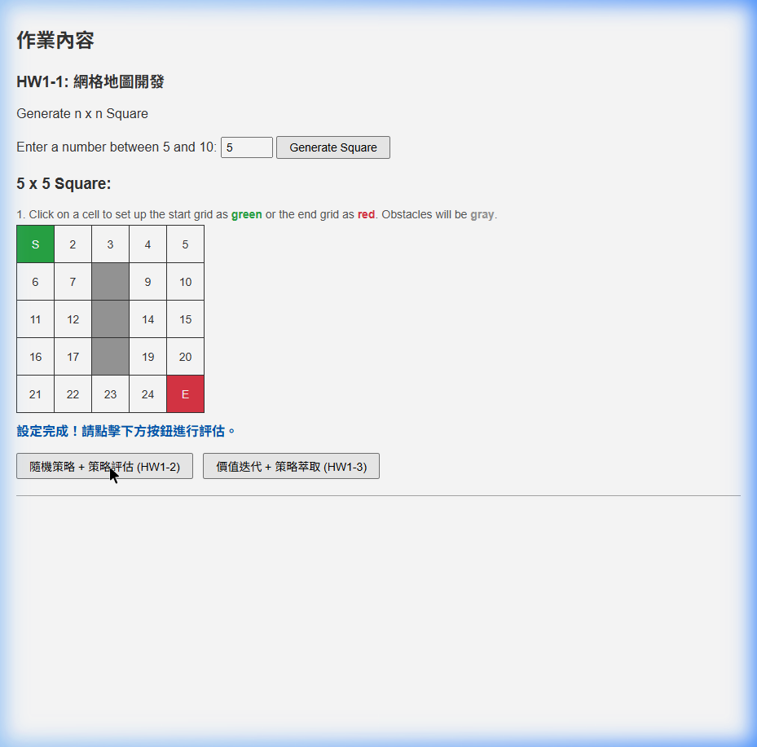
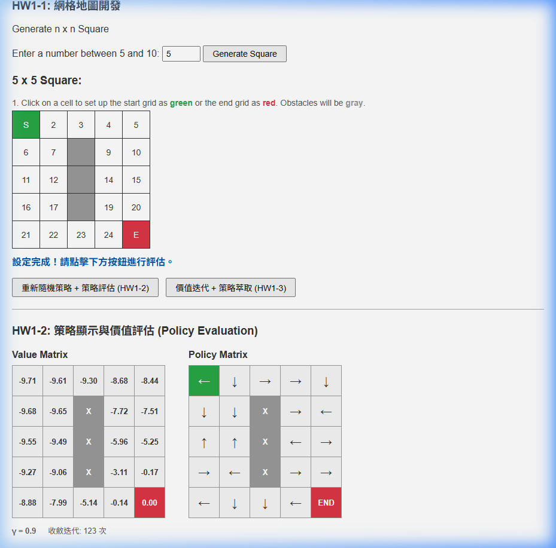
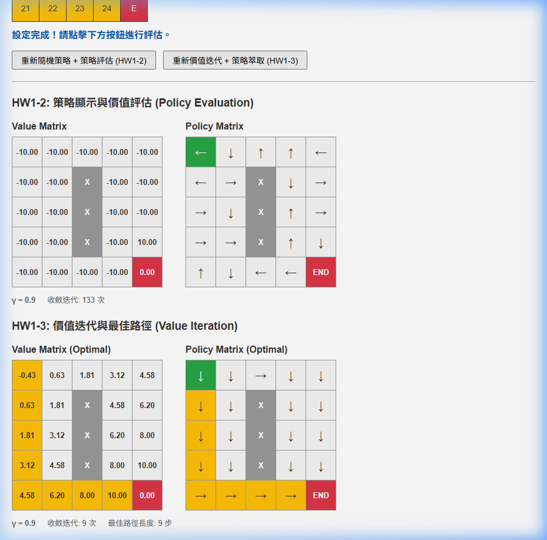

# HW1 - 網格地圖開發 & 策略評估

深度強化學習作業一：使用 Flask 建構網格世界 (Grid World) 的策略評估與價值迭代系統。

---

## 📋 作業內容

### HW1-1：網格地圖開發 (60%)
- 生成 n × n 網格地圖（n = 5~10）
- 點擊設定**起點**（綠色）、**終點**（紅色）、**障礙物**（灰色，共 n-2 個）
- 障礙物支援 toggle 切換（點擊取消）

### HW1-2：策略顯示與價值評估 (40%)
- 隨機策略生成（均勻隨機，每個動作機率 25%）
- **策略評估 (Policy Evaluation)**：使用 Bellman 方程式的動作機率加權和

### HW1-3：價值迭代與路徑最佳化
- **價值迭代 (Value Iteration)**：使用 Max 運算找最佳價值函數
- **策略萃取 (Policy Extraction)**：使用 Argmax 運算決定最佳動作
- 最佳路徑繪製（黃色標示）

---

## 🛠 技術架構

| 層級 | 技術 |
|---|---|
| 後端 | Python / Flask |
| 前端 | HTML / CSS / JavaScript |
| 通訊 | AJAX (fetch API) |

---

## 🚀 安裝與執行

```bash
# 安裝 Flask
pip install flask

# 執行
python app.py
```

啟動後開啟瀏覽器前往：**http://127.0.0.1:5000**

---

## 📐 核心演算法

### 策略評估 (Policy Evaluation) — HW1-2

使用隨機策略（Stochastic Policy），每個動作機率 π(a|s) = 0.25：

```
V(s) = Σ π(a|s) × [R(s,a) + γ · V(s')]
     = 0.25 × [R + γV(上)] + 0.25 × [R + γV(下)] + 0.25 × [R + γV(左)] + 0.25 × [R + γV(右)]
```

### 價值迭代 (Value Iteration) — HW1-3

對所有動作取 Max，直接找最佳價值函數：

```
V(s) = max_a [R(s,a) + γ · V(s')]
```

### 策略萃取 (Policy Extraction)

使用 Argmax 從收斂的價值函數中提取最佳動作：

```
π*(s) = argmax_a [R(s,a) + γ · V*(s')]
```

### 參數設定

| 參數 | 值 | 說明 |
|---|---|---|
| γ (gamma) | 0.9 | 折扣因子 |
| R_step | -1 | 每步獎勵 |
| R_goal | 10 | 到達終點獎勵 |
| θ (theta) | 1e-6 | 收斂閾值 |

---

## 🎮 程式 Demo

### 1. 網格地圖設定 (HW1-1)

生成 5×5 網格，設定起點 (S)、終點 (E) 和 3 個障礙物：



### 2. 策略評估結果 (HW1-2)

使用隨機策略的 Policy Evaluation，Value Matrix 顯示各狀態的價值：



- 靠近終點的格子價值較高（接近 0）
- 遠離終點的格子價值較低（接近 -10）
- 每個格子的箭頭代表隨機生成的策略方向

### 3. 價值迭代與最佳路徑 (HW1-3)

使用 Value Iteration 找到最佳策略，並標示最佳路徑：



- **Value Matrix (Optimal)**：最佳價值函數，值從起點遞增至終點
- **Policy Matrix (Optimal)**：所有箭頭指向最佳路徑方向
- 黃色標示的格子為**最佳路徑**

---

## 📁 檔案結構

```
hw1/
├── app.py                  # Flask 後端（PE + VI + 策略萃取）
├── templates/
│   └── index.html          # 前端介面
├── screenshots/            # Demo 截圖
│   ├── demo1_grid.png
│   ├── demo2_pe.png
│   └── demo3_vi.png
├── .gitignore
└── README.md
```

---

## 📊 演算法比較

| 演算法 | 核心運算 | 輸出目標 | 收斂速度 |
|---|---|---|---|
| 策略評估 (PE) | 動作機率加權和 (Σ) | 估算給定策略的價值 | ~120+ 次迭代 |
| 價值迭代 (VI) | 取最大動作價值 (Max) | 直接找最佳價值函數 | ~9 次迭代 |
| 策略萃取 | Argmax 運算 | 決定最終最佳動作 | 1 次遍歷 |
